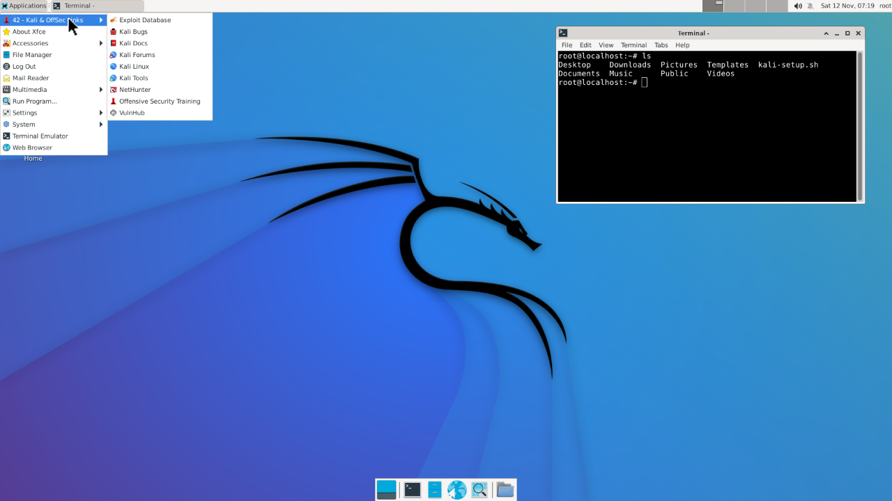
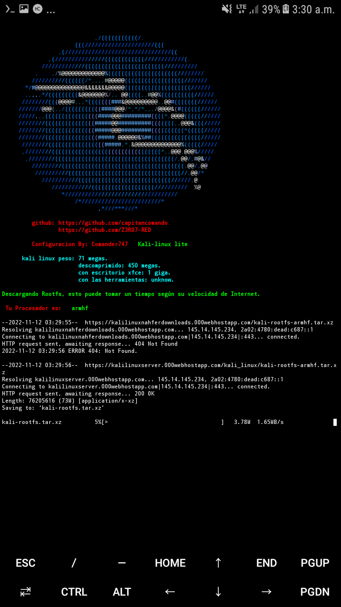

<!DOCTYPE html>
<html>
<head>
<body bgcolor=black text=lime>

Kali linux lite es un script instalador de kali linux liviano
La instalacion se hace desde termux.

Este kali linux lite no contiene las herramientas
Que vienen en kali linux oficial, pero si posee sus repositorios
Para instalarlos desde la terminal.

Por lo tanto con kali linux lite puedes tener kali linux
Sin herramientas instaladas, para que tu instales las que necesites
Atu antojo.

Creador del script: Comander-747.

Configuracion By: Comander747

kali linux peso: 71 megas.

descomprimido: 450 megas.

con escritorio xfce: 1 giga

<h1> comandos de instalacion kali lite </h1>

     apt update && apt upgrade -y
     pkg install git wget
     git clone https://github.com/capitancomando/kali-lite/
     cd kali-lite 
     bash install-kali.sh

<h2>Comandos para ajecutar kali-linux</h2> 

cd ~/kali_linux && ./start-kali.sh

Una vez dentro de kali, ejecuta:  bash kali-setup.sh

</body></head></html>

